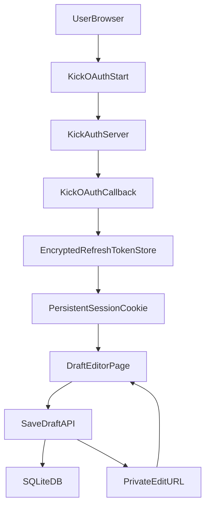

# DMM Draft Order App Plan

## Scope
Build a web app from this repo root that:
- Authenticates users with Kick OAuth (required before creating or editing drafts).
- Keeps users signed in for at least 30 days in Linux-hosted production deployments.
- Lets users reorder creator images only (drag/drop, no free-text entry).
- Saves draft orders and returns a unique edit URL.
- Restricts editing to the original Kick account owner.
- Stores only minimal Kick account data: Kick username plus encrypted auth token fields needed for session continuity.
- Never logs raw access/refresh tokens or other sensitive OAuth secrets.

## Code Quality Constraints (Open Source)
- Keep implementation clean and maintainable for public repository standards.
- Do not add inline code comments except where technically unavoidable.
- Keep functions consolidated and cohesive; avoid unnecessary fragmentation.
- Enforce strict TypeScript typing end-to-end with no `any` usage.
- Prefer small, typed utility helpers only when they reduce duplication without scattering logic.

## References (Local Only)
- Kick app setup and OAuth flow: [KickDevDocs-main/KickDevDocs-main/getting-started/kick-apps-setup.md](KickDevDocs-main/KickDevDocs-main/getting-started/kick-apps-setup.md), [KickDevDocs-main/KickDevDocs-main/getting-started/generating-tokens-oauth2-flow.md](KickDevDocs-main/KickDevDocs-main/getting-started/generating-tokens-oauth2-flow.md)
- Kick scopes (use `user:read`): [KickDevDocs-main/KickDevDocs-main/scopes/scopes.md](KickDevDocs-main/KickDevDocs-main/scopes/scopes.md)
- Current image assets source: [images/](images/)

## Proposed Architecture

## Implementation Plan
1. **Initialize app foundation (Next.js + TS + plain SQLite)**
   - Create a Next.js full-stack app and SQLite setup without ORM tooling.
   - Remove Prisma-related dependencies/config if present from interrupted setup (`@prisma/client`, `prisma`).
   - Add environment configuration for Kick OAuth (`KICK_CLIENT_ID`, `KICK_CLIENT_SECRET`, `KICK_REDIRECT_URI`, `SESSION_SECRET`).
   - Add Linux-friendly runtime config and scripts for production (`NODE_ENV=production`, build/start commands, and writable data path for SQLite).

2. **Model data for owner-bound drafts**
   - Define SQL schema and migrations for `users`, `sessions`, and `drafts` in [src/server/db/schema.sql](src/server/db/schema.sql).
   - Store drafts as ordered arrays of image IDs in JSON, plus `ownerUserId`, `publicId`, and hashed `editKey`.
   - Persist only Kick username for identity data (`kickUsername`) and encrypted token fields required for auth/session refresh (`access_token`, `refresh_token`, `token_type`, `expires_in`, `scope`), with key rotation support via env.
   - Implement typed query helpers in [src/server/db/queries.ts](src/server/db/queries.ts) with no `any`.

3. **Implement Kick OAuth login flow (PKCE + state)**
   - Add auth routes in [src/app/auth/kick/start/route.ts](src/app/auth/kick/start/route.ts) and [src/app/auth/kick/callback/route.ts](src/app/auth/kick/callback/route.ts).
   - Exchange auth code at `https://id.kick.com/oauth/token` per local docs and request `user:read` scope.
   - Store encrypted refresh token server-side and issue a persistent signed session cookie with a 30+ day max age.
   - Add refresh flow using Kick refresh token endpoint so valid returning users do not need to re-login during the one-month window.
   - Use Linux production cookie policy in [src/lib/session.ts](src/lib/session.ts): `Secure=true` over HTTPS, `HttpOnly=true`, `SameSite=Lax`, and explicit domain handling via env.
   - Add strict server log redaction in auth routes so token values are never written to logs.

4. **Define participant/captain image manifest (no text input)**
   - Add a manifest file (for stable IDs independent of filename changes) in [src/data/participants.ts](src/data/participants.ts).
   - Split data into 6 captains and 24 picks, each with image path and display label.

5. **Build draft UI as image-only ordering workflow**
   - Add editor page at [src/app/draft/new/page.tsx](src/app/draft/new/page.tsx) and [src/app/d/[publicId]/[editKey]/page.tsx](src/app/d/[publicId]/[editKey]/page.tsx).
   - Implement drag/drop ordering with keyboard support (using dnd-kit).
   - Enforce "no typing" by rendering only selectable/draggable image cards.

6. **Save/load APIs with owner-only edit authorization**
   - Add create/update/get routes in [src/app/api/drafts/route.ts](src/app/api/drafts/route.ts) and [src/app/api/drafts/[publicId]/route.ts](src/app/api/drafts/[publicId]/route.ts).
   - Create draft: persist order + generate `{publicId}` and secret `{editKey}`; return URL `/d/{publicId}/{editKey}`.
   - Update draft: require both valid session owner match and matching `editKey` hash.

7. **Anti-spam protections and guardrails**
   - Require auth for draft creation/update.
   - Add per-IP and per-user rate limiting middleware in [src/middleware.ts](src/middleware.ts) (especially on `/api/drafts`).
   - Optional hard cap (for example 20 drafts/day/user) configurable via env.

8. **Validation, UX polish, and smoke tests**
   - Validate exact ordering structure (all picks unique, expected counts).
   - Add clear states for unauthenticated users, expired session, invalid URL key, and save success.
   - Add explicit checks that users remain authenticated across browser restarts and for long-lived sessions on Linux production config.
   - Verify logs include only non-sensitive metadata (for example username and event status) and never token secrets.
   - Add basic tests for auth callback validation and draft authorization logic.
   - Run strict type checks and resolve all type issues without using `any`.

9. **Privacy disclosure in UI**
   - Add a concise notice on login and draft pages: “We only store your Kick username and auth token data required to keep you logged in.”
   - Link to a short privacy section/page describing retained fields and edit URL behavior.

## Deployment Notes (Linux)
- Target deployment is Linux; runtime behavior and startup scripts are validated for Linux server execution.
- SQLite path is configured to a writable Linux directory (environment-driven) to avoid container/readonly filesystem issues.
- Reverse proxy must terminate HTTPS so secure cookies function correctly.

## Deliverables
- Working app ready for Linux deployment that supports Kick login, image-only draft ordering, private edit URLs, and owner-only edits.
- Seeded participant/captain manifest tied to files under [images/](images/) and easy to update when filenames are renamed.